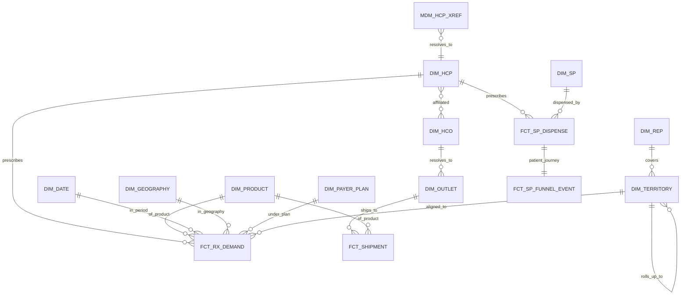

# Gold Star ERD

```mermaid
erDiagram
    DIM_HCP ||--o{ FCT_RX_DEMAND : prescribes
    DIM_PRODUCT ||--o{ FCT_RX_DEMAND : of_product
    DIM_DATE ||--o{ FCT_RX_DEMAND : in_period
    DIM_GEOGRAPHY ||--o{ FCT_RX_DEMAND : in_geography
    DIM_PAYER_PLAN ||--o{ FCT_RX_DEMAND : under_plan
    DIM_TERRITORY ||--o{ FCT_RX_DEMAND : aligned_to
    DIM_OUTLET ||--o{ FCT_SHIPMENT : ships_to
    DIM_PRODUCT ||--o{ FCT_SHIPMENT : of_product
    DIM_HCO ||--o{ DIM_OUTLET : resolves_to
    DIM_HCP ||--o{ FCT_SP_DISPENSE : prescribes
    DIM_SP ||--o{ FCT_SP_DISPENSE : dispensed_by
    FCT_SP_DISPENSE ||--|| FCT_SP_FUNNEL_EVENT : patient_journey
    DIM_HCP }o--o{ DIM_HCO : affiliated
    DIM_TERRITORY ||--o{ DIM_TERRITORY : rolls_up_to
    DIM_REP ||--o{ DIM_TERRITORY : covers
    MDM_HCP_XREF }o--|| DIM_HCP : resolves_to
```

Regenerated by `pcdm erd`. Source of truth also in `erd.dbml`.
